# Bookstore Application - Detailed Functionalities

## Overview
The Bookstore Application is a comprehensive digital platform designed to manage and showcase a collection of books. It provides a user-friendly interface for browsing books, viewing detailed information, and performing various book management operations.

## Core Functionalities

### 1. Book Catalog Management

#### 1.1 Book Listing
- **Display a comprehensive list of available books** with essential information:
  - Title
  - Author
  - Brief description
  - Price
- **Responsive grid layout** that adapts to different screen sizes
- **Loading states** to indicate when book data is being fetched
- **Error handling** to display user-friendly messages when data cannot be retrieved

#### 1.2 Book Details View
- **Detailed book information display** including:
  - Title and author
  - Full description
  - ISBN (International Standard Book Number)
  - Price
- **Navigation** between book list and detailed view
- **"Add to Cart" functionality** (currently UI only, to be implemented in future iterations)

### 2. Book Data Management

#### 2.1 Book Creation
- **Add new books** to the catalog with the following information:
  - Title
  - Author
  - Description
  - Price
  - ISBN

#### 2.2 Book Updates
- **Modify existing book information** including:
  - Title
  - Author
  - Description
  - Price
  - ISBN

#### 2.3 Book Removal
- **Delete books** from the catalog

### 3. Data Persistence

- **Database storage** of all book information
- **Automatic initialization** with sample books when the database is empty
- **Data validation** to ensure integrity of book information

### 4. API Services

#### 4.1 Backend API Endpoints
- **GET /api/books** - Retrieve all books
- **GET /api/books/{id}** - Retrieve a specific book by ID
- **POST /api/books** - Create a new book
- **PUT /api/books/{id}** - Update an existing book
- **DELETE /api/books/{id}** - Remove a book from the catalog

#### 4.2 Frontend API Services
- **Client-side service layer** for communicating with backend endpoints
- **Promise-based API calls** with proper error handling
- **Type-safe data transfer** between frontend and backend

### 5. Book Download Functionality

#### 5.1 Book Export Options
- **PDF Download** - Export book details in PDF format for offline reading
- **EPUB Download** - Download books in EPUB format for e-readers
- **CSV Export** - Export book catalog data in CSV format for data analysis

#### 5.2 Download Management
- **Progress tracking** for large file downloads
- **Resumable downloads** for interrupted connections
- **Batch download** capability for multiple books

### 6. Book Upload with AI Description Generation

#### 6.1 Book Upload Interface
- **Drag-and-drop functionality** for easy file uploads
- **Multiple format support** (PDF, EPUB, DOCX)
- **Metadata extraction** from uploaded files

#### 6.2 AI-Powered Description Generation
- **LLM integration** for automatic book description generation
- **Content analysis** to identify key themes and topics
- **Description customization** options before saving
- **Multi-language support** for generated descriptions

#### 6.3 Upload Processing
- **Background processing** for large files
- **Status notifications** for upload progress
- **Error handling** for failed uploads with recovery options

## Technical Implementation Details

### Backend Architecture
- **Spring Boot framework** for robust server-side implementation
- **RESTful API design** following best practices
- **Service-oriented architecture** with clear separation of concerns:
  - Controllers for handling HTTP requests
  - Services for business logic
  - Repositories for data access
  - Models for data representation
- **JPA/Hibernate** for object-relational mapping
- **PostgreSQL** for production data storage
- **H2 Database** for testing environments

### Frontend Architecture
- **React** with TypeScript for type-safe component development
- **Component-based UI** with clear separation of concerns:
  - BookList component for displaying the book catalog
  - BookDetail component for showing detailed book information
  - App component for overall application structure and state management
- **State management** using React hooks
- **Responsive design** with TailwindCSS
- **Axios** for HTTP requests to the backend API

## Future Enhancement Opportunities

### 1. User Management
- User registration and authentication
- User profiles with preferences and history

### 2. Shopping Cart Functionality
- Add books to cart
- Manage cart contents
- Checkout process

### 3. Search and Filtering
- Search books by title, author, or ISBN
- Filter books by price range, genre, etc.

### 4. Reviews and Ratings
- Allow users to rate books
- Enable users to write and read reviews

### 5. Order Management
- Process book orders
- Track order status
- Order history

### 6. Admin Dashboard
- Comprehensive book management interface
- Sales reports and analytics
- User management

## Conclusion
The Bookstore Application provides a solid foundation for a digital bookstore with core book management functionalities. Its modular architecture allows for easy extension and enhancement to meet evolving business requirements.

## Diagram

```mermaid
graph TB
    %% Main Components
    subgraph "Client Side"
        REACT[⚛️ React<br/>TypeScript<br/>- Book Catalog UI<br/>- Upload Interface<br/>- Download Manager]
    end

    subgraph "Server Side"
        BE[🍃 Spring Boot<br/>Java API<br/>- REST Endpoints<br/>- Business Logic<br/>- File Processing]
    end

    subgraph "Data Storage"
        DB[🐘 PostgreSQL<br/>📊 H2 Database<br/>- Book Metadata<br/>- User Data<br/>- Upload Records]
        FS[📁 File System<br/>- PDF Files<br/>- EPUB Files<br/>- DOCX Files]
    end

    subgraph "AI Services"
        OLLAMA[🦙 Ollama<br/>Local LLM Provider<br/>- Llama Models<br/>- Content Analysis<br/>- Auto Description<br/>- Multi-language Support]
    end

    %% Connections
    REACT <-->|REST API| BE
    BE <-->|JPA/Hibernate| DB
    BE <-->|File I/O| FS
    BE <-->|HTTP API| OLLAMA

    %% Data Flow Labels
    REACT -.->|Book CRUD Operations| BE
    REACT -.->|File Upload| BE
    REACT -.->|Download Requests| BE
    BE -.->|Metadata Storage| DB
    BE -.->|File Storage| FS
    BE -.->|Description Generation| OLLAMA

    %% Styling
    classDef frontend fill:#e3f2fd
    classDef backend fill:#f3e5f5
    classDef data fill:#e8f5e8
    classDef ai fill:#fff3e0

    class REACT frontend
    class BE backend
    class DB,FS data
    class OLLAMA ai
```

## References

[Spring boot + Ollama](https://docs.spring.io/spring-ai/reference/api/chat/ollama-chat.html)