# Document Management Application - Detailed Functionalities

## Overview
The Document Management Application is a comprehensive digital platform designed to manage and showcase a collection of documents. It provides a user-friendly interface for browsing documents, viewing detailed information, uploading new files, and managing document-related operations.

## Core Functionalities

### 1. Document Catalog Management

#### 1.1 Document Listing
- **Display a comprehensive list of available documents** with essential information:
  - Title  
  - Author  
  - Brief description  
  - File type / size
- **Responsive grid layout** that adapts to different screen sizes  
- **Loading states** to indicate when document data is being fetched  
- **Error handling** to display user-friendly messages when data cannot be retrieved  

#### 1.2 Document Details View
- **Detailed document information display** including:
  - Title and author  
  - Full description  
  - File metadata (type, size, upload date)
- **Navigation** between document list and detailed view  
- **"Download" functionality** for available file formats  

### 2. Document Data Management

#### 2.1 Document Upload
- **Add new documents** to the catalog with:
  - Title  
  - Author  
  - Description  
  - File upload (PDF, DOCX, etc.)

#### 2.2 Document Updates
- **Modify existing document information**, including:
  - Title  
  - Author  
  - Description  
  - Replace uploaded file  

#### 2.3 Document Removal
- **Delete documents** from the catalog  

### 3. Data Persistence
- **Database storage** of all document information  
- **Automatic initialization** with sample documents when the database is empty  
- **Data validation** to ensure integrity of uploaded documents  

### 4. API Services

#### 4.1 Backend API Endpoints
- `GET /api/documents` - Retrieve all documents  
- `GET /api/documents/{id}` - Retrieve a specific document by ID  
- `POST /api/documents` - Create a new document  
- `PUT /api/documents/{id}` - Update an existing document  
- `DELETE /api/documents/{id}` - Remove a document from the catalog  

#### 4.2 Frontend API Services
- **Angular service layer** for communicating with backend endpoints  
- **Observable-based API calls** using `HttpClient`  
- **Type-safe data transfer** between frontend and backend  

### 5. Document Download Functionality

#### 5.1 Export Options
- **PDF Download** - Export individual documents  
- **CSV Export** - Export document catalog data for reporting  
- **Batch download** - Select and download multiple documents at once  

#### 5.2 Download Management
- **Progress tracking** for large file downloads  
- **Resumable downloads** for interrupted connections  
- **Batch download** capability for multiple files  

### 6. Document Upload with AI Description Generation

#### 6.1 Upload Interface
- **Drag-and-drop functionality** for easy file uploads  
- **Multiple format support** (PDF, DOCX, etc.)  
- **Automatic metadata extraction** (title, author, etc.)

#### 6.2 AI-Powered Description Generation
- **LLM integration** for automatic document description  
- **Content analysis** to identify key themes and topics  
- **Customization options** for editing generated description  
- **Multi-language support**  

#### 6.3 Upload Processing
- **Background processing** for large files  
- **Status notifications** for upload progress  
- **Error handling** with recovery options  

## Technical Implementation Details

### Backend Architecture
- **Spring Boot framework** for robust server-side implementation  
- **RESTful API design** following best practices  
- **Service-oriented architecture**:
  - Controllers (HTTP handling)  
  - Services (business logic)  
  - Repositories (data access)  
  - Models (data representation)  
- **JPA/Hibernate** for object-relational mapping  
- **PostgreSQL** for production  
- **H2 Database** for development and testing  

### Frontend Architecture
- **Angular with TypeScript** for scalable, maintainable UI  
- **Component-based structure**:
  - `DocumentListComponent`  
  - `DocumentDetailComponent`  
  - `UploadComponent`, `DownloadManagerComponent`  
- **State management** using RxJS and services  
- **Responsive design** with Angular Material and TailwindCSS  
- **HttpClientModule** for backend communication  

## Future Enhancement Opportunities

### 1. User Management
- User registration and authentication  
- User preferences and history  

### 2. Advanced Search and Filtering
- Search by title, author, file type  
- Filter by date, file size, etc.  

### 3. Document Reviews and Comments
- User comments on documents  
- Rating system  

### 4. Workflow and Access Control
- Document approval workflow  
- Role-based access and permissions  

### 5. Admin Dashboard
- Global document management interface  
- Analytics and usage reports  
- User management  

## Conclusion
The Document Management Application provides a strong foundation for managing and sharing documents with extensible architecture. The modular design allows for scalable growth and easy integration of additional features.

## Diagram

```mermaid
graph TB
    %% Main Components
    subgraph "Client Side"
        ANGULAR[🅰️ Angular
TypeScript
- Document Catalog UI
- Upload Interface
- Download Manager]
    end

    subgraph "Server Side"
        BE[🍃 Spring Boot
Java API
- REST Endpoints
- Business Logic
- File Processing]
    end

    subgraph "Data Storage"
        DB[🐘 PostgreSQL
📊 H2 Database
- Document Metadata
- User Data
- Upload Records]
        FS[📁 File System
- PDF Files
- DOCX Files]
    end

    subgraph "AI Services"
        OLLAMA[🦙 Ollama
Local LLM Provider
- Llama Models
- Content Analysis
- Auto Description
- Multi-language Support]
    end

    %% Connections
    ANGULAR <-->|REST API| BE
    BE <-->|JPA/Hibernate| DB
    BE <-->|File I/O| FS
    BE <-->|HTTP API| OLLAMA

    %% Data Flow Labels
    ANGULAR -.->|Document CRUD Operations| BE
    ANGULAR -.->|File Upload| BE
    ANGULAR -.->|Download Requests| BE
    BE -.->|Metadata Storage| DB
    BE -.->|File Storage| FS
    BE -.->|Description Generation| OLLAMA

    %% Styling
    classDef frontend fill:#e3f2fd
    classDef backend fill:#f3e5f5
    classDef data fill:#e8f5e8
    classDef ai fill:#fff3e0

    class ANGULAR frontend
    class BE backend
    class DB,FS data
    class OLLAMA ai
```

## References

[Spring boot + Ollama](https://docs.spring.io/spring-ai/reference/api/chat/ollama-chat.html)